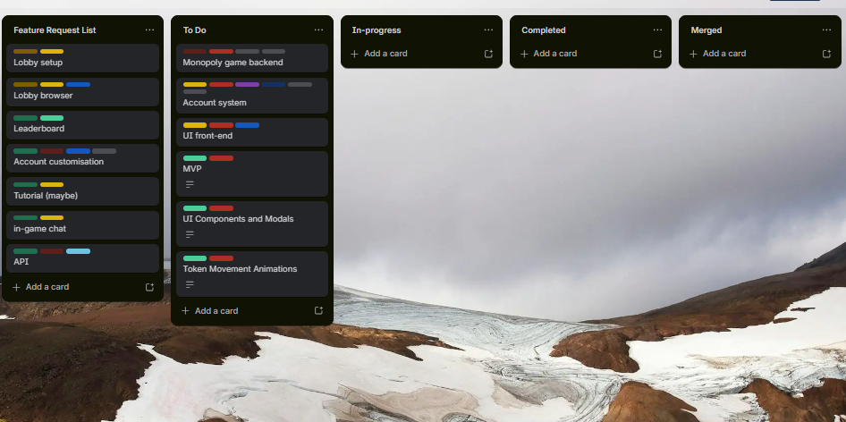

# Meeting Minute for 31/03/2026
## Attendance
- Anthony (in-person)
- Shuo (in-person)
- Zhirui (in-person, late)

## Action items
### Anthony
- chose online monopoly game as project topic
- added some feature requests and tagged accordingly
- gotten some BS5/CSS practice in
### Shuo
- the selection specifies the development tools for the front-end
- the tools for graphic production have been confirmed
- the logival animations for the front end have been determined
### Zhirui
- learning Flask for the project
- assigned to work on the lobby page
- currently working on the lobby page

## Talking points
### Finalise project idea
- Final vote between msg board and multiplayer monopoly game
- Decided on monopoly
- Started feature request board [here](https://trello.com/b/rI1gxeCV/cits3403workboard), doing ticket assignments and categorizing

- Added some core feature requests such as account systems, core gameplay, session management, API

### Finalising on tech stack
- Shuo to decide between Tailwind/BS5 for front-end
- UX flow and UI mockup to be done on Figma
- Anthony: Start research on account and session management as well as looking into nice-to-haves (profile customisation, stat tracking,etc.)

### Progress report
- Need to have core features mockup by next checkpoint meeting
- Should start assembly of core components first (game logic, network handler, API, etc.) then start working on specific features
- Core features that are high-priority are marked on Trello board
- Shuo: look at making game lobby mockup itself
- Zhirui: look at assynchronous programming for turn-based player interraction
- Anthony: start making game logic (py)

Meeting end 15:04
